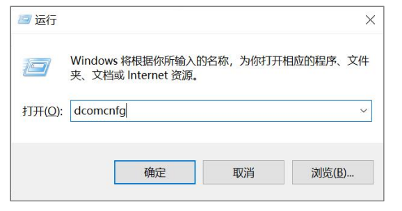
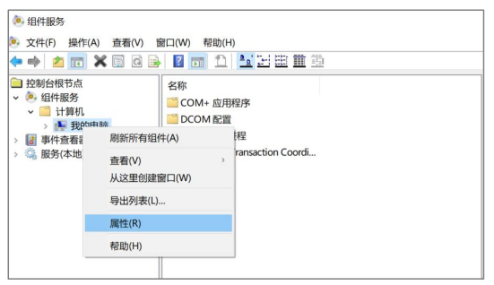
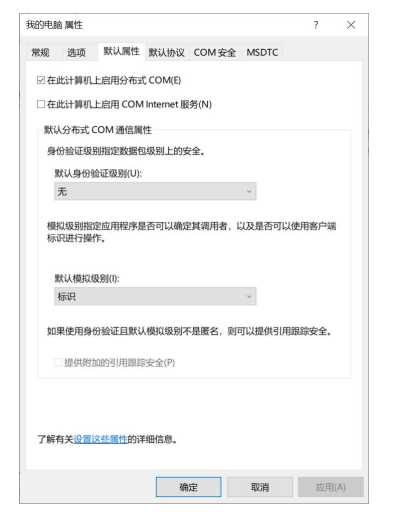
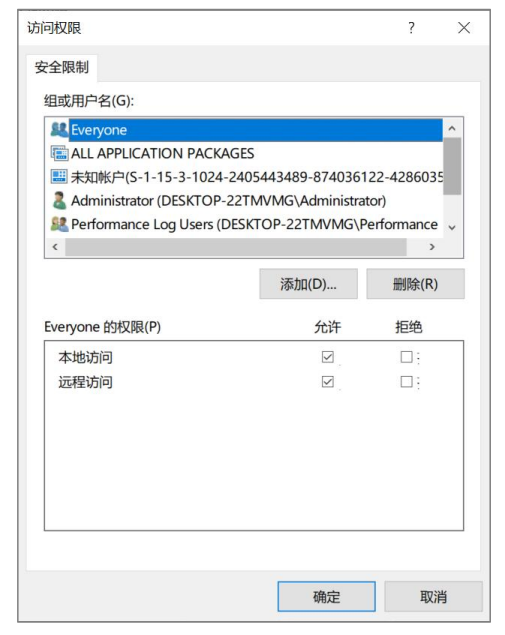
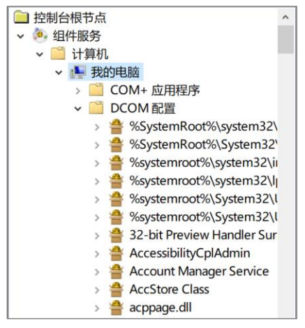
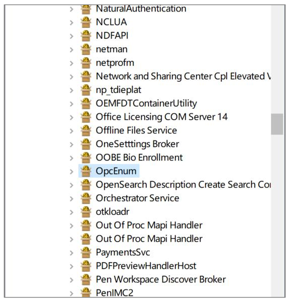
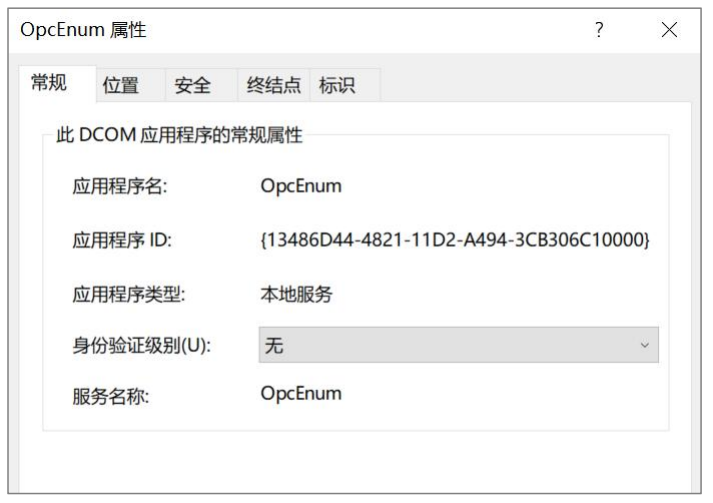
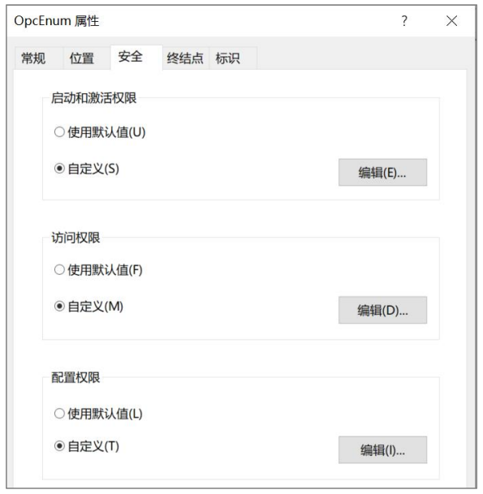
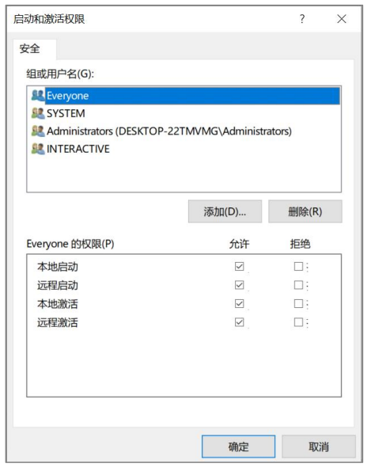
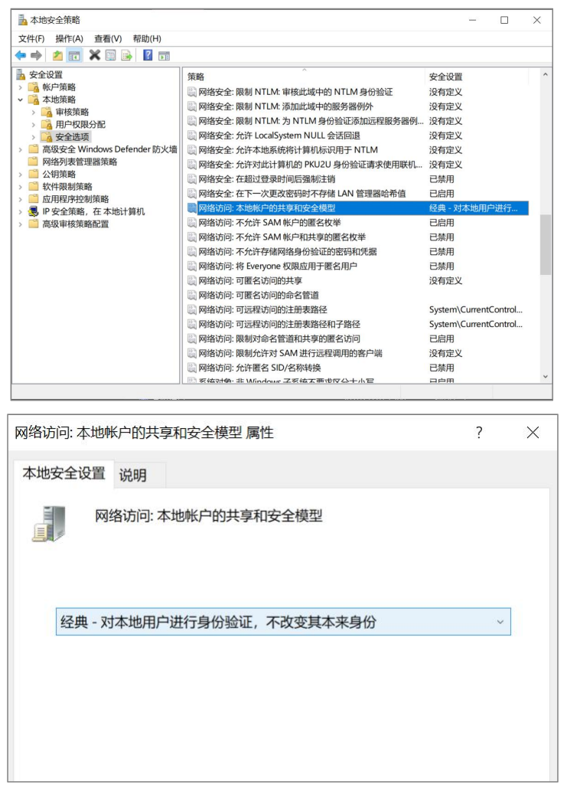

# 📚 OPC DA to MSA 项目文档索引

## 📖 文档目录

### 🚀 项目说明
- **[PROJECT_README.md](./PROJECT_README.md)** - 项目主要说明文档

### 🔧 技术文档
- **[REFACTORING_VERIFICATION_REPORT.md](./REFACTORING_VERIFICATION_REPORT.md)** - 重构验证报告
- **[tests-README.md](./tests-README.md)** - 测试相关文档
- **[OPC_CONNECTION_CONFIG.md](./docs/OPC_CONNECTION_CONFIG.md)** - OPC连接配置指南
- **[OPC_SERVER_SETUP_GUIDE.md](./docs/OPC_SERVER_SETUP_GUIDE.md)** - OPC服务器安装和配置指南
- **[OPC_CONNECTION_TROUBLESHOOTING.md](./docs/OPC_CONNECTION_TROUBLESHOOTING.md)** - OPC连接故障排除指南

### 🐛 问题修复报告
- **[COMPILATION_ERROR_FIX_REPORT.md](./COMPILATION_ERROR_FIX_REPORT.md)** - 编译错误修复报告
- **[DEPENDENCY_INJECTION_COMPILATION_FIX_REPORT.md](./DEPENDENCY_INJECTION_COMPILATION_FIX_REPORT.md)** - 依赖注入编译修复报告
- **[DUPLICATE_DEFINITION_FIX_REPORT.md](./DUPLICATE_DEFINITION_FIX_REPORT.md)** - 重复定义修复报告
- **[FINAL_COMPILATION_ERROR_FIX_REPORT.md](./FINAL_COMPILATION_ERROR_FIX_REPORT.md)** - 最终编译错误修复报告
- **[FINAL_COMPILATION_ERROR_FIX_REPORT_FINAL.md](./FINAL_COMPILATION_ERROR_FIX_REPORT_FINAL.md)** - 最终编译错误修复报告（最终版）
- **[FINAL_DEPENDENCY_INJECTION_FIX_REPORT.md](./FINAL_DEPENDENCY_INJECTION_FIX_REPORT.md)** - 最终依赖注入修复报告
- **[INTERFACE_IMPLEMENTATION_FIX_REPORT.md](./INTERFACE_IMPLEMENTATION_FIX_REPORT.md)** - 接口实现修复报告
- **[MSATCP_COMPILATION_ERROR_FIX_REPORT.md](./MSATCP_COMPILATION_ERROR_FIX_REPORT.md)** - MSA TCP编译错误修复报告

### 📋 配置文档
- **[DCOM配置手册.pdf](./DCOM配置手册.pdf)** - DCOM配置手册
- **[HOLLiAS iComm.chm](./HOLLiAS%20iComm.chm)** - HOLLiAS iComm帮助文档

### 🖼️ 配置截图
- **** - DCOM配置截图 0
- **** - DCOM配置截图 1
- **** - DCOM配置截图 2
- **** - DCOM配置截图 3
- **** - DCOM配置截图 4
- **** - DCOM配置截图 5
- **** - DCOM配置截图 6
- **** - DCOM配置截图 7
- **** - DCOM配置截图 8
- **** - DCOM配置截图 9

## 📁 文档结构说明

```
docs/
├── README.md                                    # 本文档（文档索引）
├── PROJECT_README.md                            # 项目主要说明
├── tests-README.md                              # 测试文档
├── REFACTORING_VERIFICATION_REPORT.md          # 重构验证报告
├── *_FIX_REPORT.md                             # 各种问题修复报告
├── DCOM配置手册.pdf                             # DCOM配置手册
├── HOLLiAS iComm.chm                           # 帮助文档
└── dcom-*.png                                  # DCOM配置截图
```

## 🔍 快速导航

- **新手入门**: 查看 [PROJECT_README.md](./PROJECT_README.md)
- **配置问题**: 查看 [DCOM配置手册.pdf](./DCOM配置手册.pdf) 和 dcom-*.png 截图
- **技术问题**: 查看各种 *_FIX_REPORT.md 文档
- **测试相关**: 查看 [tests-README.md](./tests-README.md)
- **重构验证**: 查看 [REFACTORING_VERIFICATION_REPORT.md](./REFACTORING_VERIFICATION_REPORT.md)

## 📝 文档更新说明

所有项目相关的Markdown文档已统一整理到 `docs/` 目录下，便于管理和查阅。

---
*最后更新: 2024年1月*